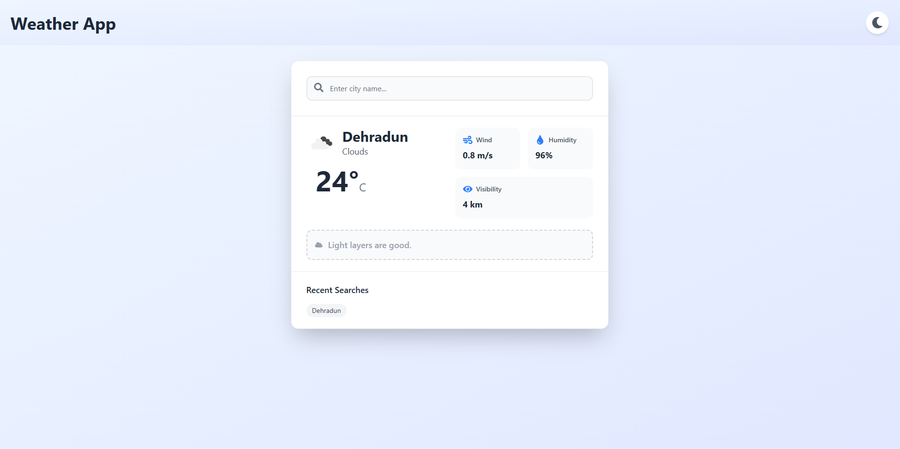

# Weather-Based Outfit Recommender

A modern weather dashboard built with React + TypeScript that displays current weather details for any city and provides outfit recommendations based on the temperature and weather condition.

[Live Demo](https://weather-based-outfit-recommender.vercel.app)



## Features

- Search for any city using OpenWeatherMap API
- View temperature, condition, wind speed, and humidity
- Get outfit suggestions (e.g., jacket, umbrella, sunglasses)
- Keeps last 5 searched cities in history
- Light/Dark mode toggle
- Graceful error handling for invalid inputs and API failures

---

## Tech Stack

- React + TypeScript
- Redux Toolkit for state management
- TailwindCSS for styling and responsive layout
- OpenWeatherMap API
- Vite

---

##  Getting Started

### 1. Clone the Repository

```bash
git clone https://github.com/your-username/weather-outfit-app.git
cd weather-outfit-app
```

### 2. Install Dependencies

```bash

npm install
```

### 3. Set Environment Variables
- Create a .env file in the root of the project with the following content:
```bash

VITE_OPEN_WEATHER_APP_ID=your_openweathermap_api_key
```
- You can get your API key from: https://openweathermap.org/api

### 4 Run the App Locally

```bash

Run the App Locally 
```
- Now open http://localhost:5173 to see the app in action.

##  Assumptions and Development Decisions

- Only current weather is shown (no forecast) to keep UX clean and focused.
- Search history is stored in-memory for this version (not persisted to localStorage).
- Uses OpenWeatherMap's current weather endpoint with metric units.
